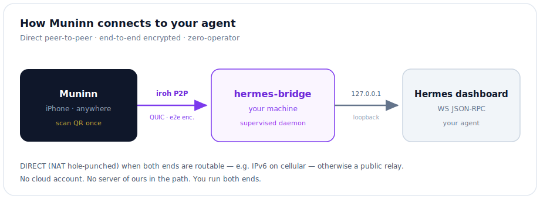
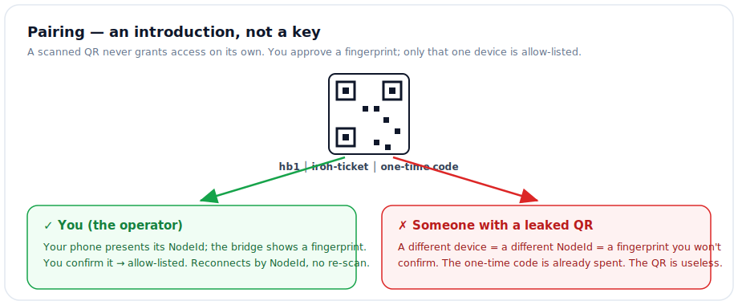

# Hermes Phone Bridge

[繁體中文](./README.md) · **English**

> Connect the **Muninn** iOS app to your own Hermes agent over [iroh](https://www.iroh.computer/) peer-to-peer — encrypted, direct, and **zero-operator**. You run both ends; nobody else is in the path.

[](./LICENSE)
[](https://www.iroh.computer/)
[]()


---

## What it is

`hermes-bridge` is a tiny Rust daemon that runs next to your Hermes install. It exposes your local Hermes dashboard to **one paired phone** over an end-to-end-encrypted iroh tunnel — so you can talk to your home agent from anywhere, on cellular, with no cloud account and no third-party server in the middle.



## Features

- **Direct P2P.** iroh hole-punches a direct path when both ends have a routable address (e.g. IPv6 on cellular), falling back to a public relay only when it must.
- **Zero operator.** No accounts, no servers you have to run, no SaaS. The bridge and the app are the whole system.
- **Pairing is the security boundary.** A scanned QR is a one-time *introduction*, not a key — a new device is allow-listed only after you confirm its fingerprint. See [SECURITY.md](./SECURITY.md).
- **Stable identity.** A persistent secret key gives the bridge a stable NodeId, so a paired phone reconnects without re-scanning.
- **Media transfer.** Dedicated channels move images/voice from the phone to the agent, and images, video, audio, and documents from the agent back to the phone.
- **Single small binary.** No runtime; no Rust toolchain needed to install — the installer fetches a prebuilt binary for your platform.

## Prerequisites

- **Hermes** running on this machine — Hermes Desktop, or the headless `hermes dashboard` CLI.
- **Muninn** on your phone — [**TestFlight public beta link**](https://testflight.apple.com/join/8mcRtXsm) (tap to install, no sign-up).
- **No Rust needed** — the installer downloads the prebuilt binary for your platform (and only builds from source if none is available).

## Install — one line to your Hermes

Paste this into your own Hermes and it runs the steps for you:

> Clone https://github.com/coolthor/hermes-bridge into ~/hermes-bridge, run its install.sh, then show me the pairing QR so I can connect my phone.

It clones the repo, downloads the prebuilt bridge binary (no Rust), installs the `connect-phone` skill, and shows the QR. Then open **Muninn** → Connect → **Scan QR Code**.

### Or run it yourself

```bash
git clone https://github.com/coolthor/hermes-bridge ~/hermes-bridge
bash ~/hermes-bridge/install.sh
```

## Everyday use

- **Show the QR again:** tell your Hermes **"connect my phone"** (or 「連接手機」) and the `connect-phone` skill re-displays it.
- **Reconnect:** once paired, your phone's NodeId is remembered — reopening the app reconnects with no re-scan.
- **Approve a new device:** a first-time device shows a code; confirm it with `run-bridge.sh approve <code>` (the bridge never auto-trusts a scanner).

## How it works

The bridge keeps a supervised process running and serves several iroh ALPNs:

| ALPN | Purpose |
|------|---------|
| `hermes-bridge/0`          | Transparent proxy of the local Hermes dashboard WebSocket |
| `hermes-bridge-upload/0`   | Phone → agent uploads (e.g. a photo you send) |
| `hermes-bridge-download/0` | Agent → phone media & files (images, video, audio, documents) |

All traffic is authenticated and encrypted by iroh's ed25519 node identities. The bridge only ever proxies to `127.0.0.1` (your dashboard) and only for allow-listed NodeIds.

## Troubleshooting

- **Stuck on `relay` (never `DIRECT`)** — hole-punching needs a routable address on both ends. On cellular this usually means IPv6; a strict/symmetric NAT or IPv4-only path falls back to relay (works, but slower and flakier). This is a network property, not a bug.
- **Bridge "went down" after restarting the dashboard** — the supervisor (`scripts/run-bridge.sh`) keeps the bridge alive; if it was killed, relaunch it:
  ```bash
  nohup bash ~/hermes-bridge/scripts/run-bridge.sh >/dev/null 2>&1 &
  ```
- **Phone won't pair** — make sure the code on the phone matches the one you `approve`; a stranger who scanned the QR shows a *different* fingerprint and must not be approved.

## Security



The QR encodes `hb1|<iroh-ticket>|<pairing-code>` — a one-time introduction, **not a key**. Only the scanning phone's NodeId is allow-listed; the pairing code is single-use and expires. **A leaked QR is useless**: an attacker is a different NodeId and the code is already spent. The connection is end-to-end authenticated by iroh's ed25519 node identities, never touches a third-party server, and carries your Hermes dashboard session token.

> ⚠️ **Pairing a device grants it agent access, which can run shell on this machine.** Only pair devices you own. Full model: [SECURITY.md](./SECURITY.md).

## License

[MIT](./LICENSE) © 2026 coolthor. Built on [iroh](https://www.iroh.computer/) by [number 0](https://n0.computer/).
